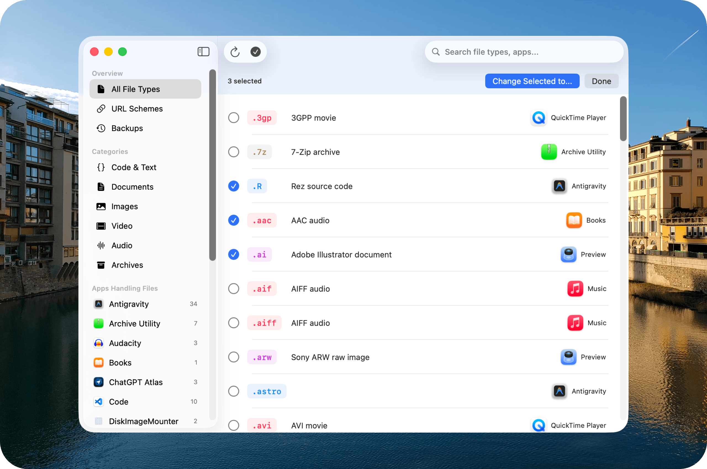

# Default Opener

<p align="center">
  
</p>

<p align="center">
  
  
  
</p>

Ever installed an app and suddenly all your files open with it? Default Opener gives you back control over which apps handle your files and URLs.

<p align="center">
  
</p>

| URL Schemes | Change All From App |
|:-:|:-:|
|  |  |

## Features

- **100+ file extensions** — Browse and change defaults for documents, code, images, videos, and more
- **URL schemes** — Control which app handles http, mailto, ssh, and other protocols
- **Bulk operations** — Select multiple file types and change them all at once
- **Backup & restore** — Save your preferences and restore them anytime
- **Instant undo** — Changed something by mistake? One-click undo via toast notification
- **Hijack detection** — Get notified when apps change your defaults without asking

## Installation

Download from [Releases](https://github.com/bernaferrari/default-opener/releases) or build from source:

```bash
git clone https://github.com/bernaferrari/default-opener
cd default-opener
xcodebuild -project DefaultOpener/DefaultOpener.xcodeproj -scheme DefaultOpener -configuration Release
```

## CLI

Prefer the command line? There's a CLI too. See [CLI documentation](docs/CLI.md) for usage.

```bash
opener set .json com.microsoft.VSCode
opener set https com.apple.Safari
opener backup
```

## Requirements

- macOS 14.0+

## License

Apache License 2.0
