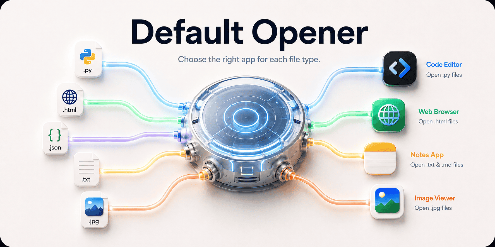
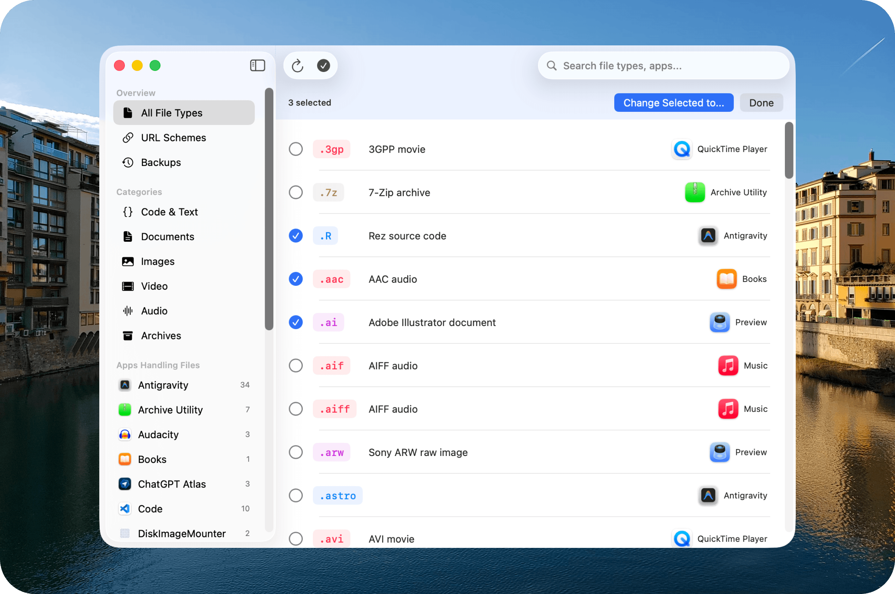

# Default Opener

<p align="center">
  
</p>

<p align="center">
  
  
  
</p>

Ever installed an app and suddenly all your files open with it? Default Opener gives you back control over which apps handle your files and URLs.

<p align="center">
  
</p>

| URL Schemes | Change All From App |
|:-:|:-:|
|  |  |

## Features

- **100+ file extensions** — Browse and change defaults for documents, code, images, videos, and more
- **URL schemes** — Control which app handles http, mailto, ssh, and other protocols
- **Bulk operations** — Select multiple file types and change them all at once
- **Backup & restore** — Save your preferences and restore them anytime
- **Instant undo** — Changed something by mistake? One-click undo via toast notification
- **Hijack detection** — Get notified when apps change your defaults without asking

## Installation

Download from [Releases](https://github.com/bernaferrari/default-opener/releases) or build from source:

```bash
git clone https://github.com/bernaferrari/default-opener
cd default-opener
xcodebuild -project DefaultOpener/DefaultOpener.xcodeproj -scheme DefaultOpener -configuration Release
```

## Requirements

- macOS 27.0+
- Xcode 27.0+

## Development and verification

Build with Xcode 27 on macOS 27:

```sh
xcodebuild -project DefaultOpener/DefaultOpener.xcodeproj -scheme DefaultOpener \
  -configuration Debug -destination 'platform=macOS' CODE_SIGNING_ALLOWED=NO build
```

Run the regression suite:

```sh
xcodebuild -project DefaultOpener/DefaultOpener.xcodeproj -scheme DefaultOpener \
  -configuration Debug -destination 'platform=macOS' CODE_SIGNING_ALLOWED=NO test
```

The tests run without an application host. They use an in-memory handler service,
isolated preferences, and temporary backup directories; they never change your
real file or URL defaults. Production handler changes use the asynchronous
`NSWorkspace` APIs. Extensions sharing a content type are changed together.

This macOS 27 version uses a new backup format with one handler per content type.
Older extension-based backups are rejected explicitly because they can contain
conflicting defaults for the same type. Existing backup files are left intact;
create a new backup before making changes with this version.

The CI workflow uses GitHub's `xcode-27` runner and builds the release configuration
before running the regression suite. Distribution still requires signing and
notarization; unsigned builds above are for local development.

## License

Apache License 2.0
